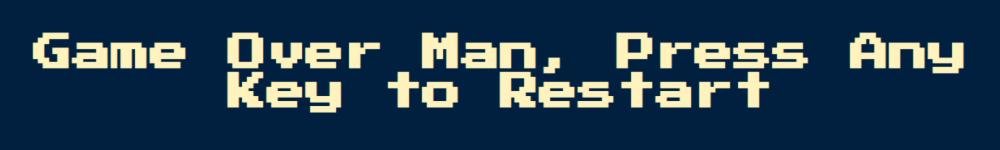

# Game-Simon

## Description

There is no surprise here; this is a web instantiation of the game Simon. The exercise is from the class The Complete Full-Stack Web Development Bootcamp taught one of my absolute favorite instructors by [Dr. Angela Yu](https://www.udemy.com/user/4b4368a3-b5c8-4529-aa65-2056ec31f37e/).

This project is a web game based on the game [Simon](<https://en.wikipedia.org/wiki/Simon_(game)>).

## Getting Started

After making a pull request or downloading the project, open the index.html in a browser.

## Git Notes

Clone the project to develop or change it.

`git clone https://github.com/ShonHarsh/Game-Simon`

### Links

- [Exercism](https://exercism.org/profiles/ShonHarsh) - Get **really** good at programming.
- [github-readme-stats](https://github.com/anuraghazra/github-readme-stats) - The repository that contains the visual stats widgets for this page.
- [LinkedIn](https://www.linkedin.com/in/shonharsh/)
- [Shon Harsh Website](https://shonharsh.github.io/curriculum-vitae/index.html) - 127.0.0.1
- [This.GitHub](https://github.com/shonharsh) - F5
- [UiPath Automation Platform](https://www.uipath.com/) - Automation Delivered
- [UiPath Studio](https://www.uipath.com/product/studio) - UiPath IDE
- [Visual Studio Code](https://code.visualstudio.com/) - Learn it, use it, love it!
