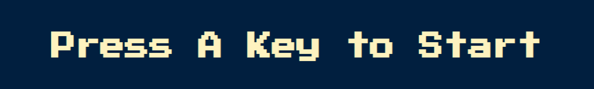
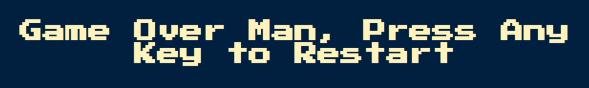

# Game-Simon

This project is a web game based on the game [Simon](https://en.wikipedia.org/wiki/Simon_(game)).

### Getting Started

After making a pull request or downloading the project, open the index.html in a browser.

### Git Notes

Clone the project to develop or change it.

`git clone https://github.com/ShonHarsh/Game-Simon`

### Links
- [Shon Harsh Website 127.0.0.1](https://shonharsh.github.io/curriculum-vitae/index.html)
- [This.GitHub](https://github.com/shonharsh)
- [LinkedIn](https://www.linkedin.com/in/shonharsh/)
